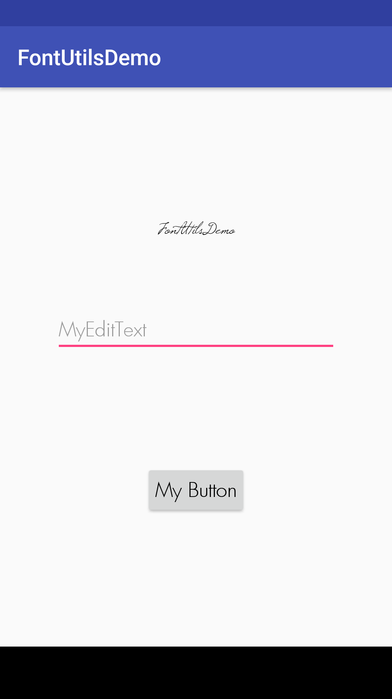

# FontUtils
FontUtilities

To get a Git project into your build:Step 2. Add the dependency

Step 1. Add the JitPack repository to your build file

Add it in your root build.gradle at the end of repositories:

	allprojects {
		repositories {
			...
			maven { url 'https://jitpack.io' }
		}
	}
Step 2. Add the dependency

	dependencies {
	        compile 'com.github.Manuaravind1989:FontUtils:0.1.0'
	}

You need to add xml as follows:
<?xml version="1.0" encoding="utf-8"?>
<LinearLayout
    xmlns:android="http://schemas.android.com/apk/res/android"
    xmlns:tools="http://schemas.android.com/tools"
    xmlns:app="http://schemas.android.com/apk/res-auto"
    android:id="@+id/activity_main"
    android:layout_width="match_parent"
    android:gravity="center"
    android:orientation="vertical"
    android:layout_height="match_parent"
    tools:context="com.mobiledev.fontutilsdemo.MainActivity">

    <com.mobiledev.fontutils.FontTextView
        android:id="@+id/txt_view"
        android:layout_width="match_parent"
        android:layout_height="wrap_content"
        android:text="@string/app_name"
        android:textColor="@android:color/black"
        android:textSize="18sp"
        android:textAllCaps="false"
        app:fontName="@string/windsong"
        android:gravity="center"
        ></com.mobiledev.fontutils.FontTextView>

    <com.mobiledev.fontutils.FontEditText
        android:id="@+id/txtedit_view"
        android:layout_width="match_parent"
        android:layout_height="wrap_content"
        android:layout_marginTop="50dp"
        android:layout_margin="50dp"
        android:hint="@string/editString"
        android:textColor="@android:color/black"
        android:textSize="18sp"
        android:textAllCaps="false"
        app:fontName="@string/futura"
        android:gravity="center|start"
        ></com.mobiledev.fontutils.FontEditText>

    <com.mobiledev.fontutils.FontButton
        android:id="@+id/button_view"
        android:layout_marginTop="50dp"
        android:layout_width="wrap_content"
        android:padding="10dp"
        android:layout_height="wrap_content"
        android:text="@string/myButton"
        android:textColor="@android:color/black"
        android:textSize="18sp"
        android:textAllCaps="false"
        app:fontName="@string/futura"
        android:gravity="center"
        ></com.mobiledev.fontutils.FontButton>

</LinearLayout>

string.xml

 <string name="futura">Futura.ttf</string>
 <string name="windsong">Windsong.ttf</string>

1. Create a assets folder in your project
2. Create a fonts folder in assets
3. Copy and paste your ttf files in this folder

